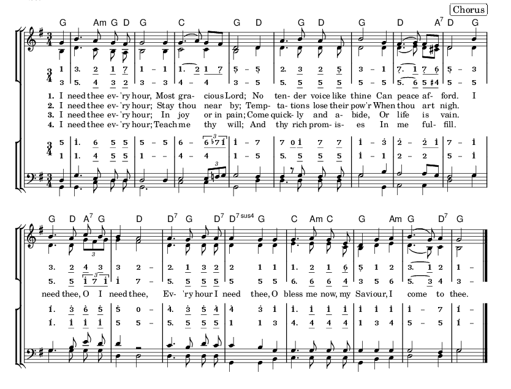

# Lilypond Cipher

Cipher notation is a way of representing music using normal letters, numbers and punctuation.
It was introduced as a way of allowing the setting of music using a typewriter. More recently
extended letters are used, but the core principles are the same.

There are various dialects of cipher notation and this module supports those currently known
and will be extended to support more. See the definition of `CipherMap` in `cipher.ly` for a
complete list.

See `Need.ly` for an example of usage. `ciphersong.ly` is a template for songs with piano
and words.

This is a sample of the Jianpu dialect of cipher. Notice the ability to intermix cipher and
western notations:

